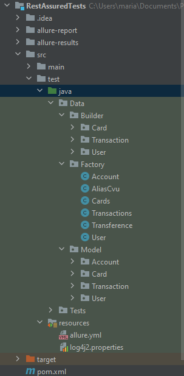
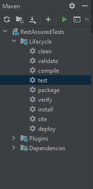
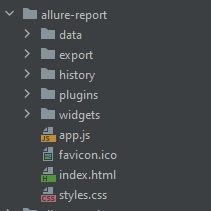
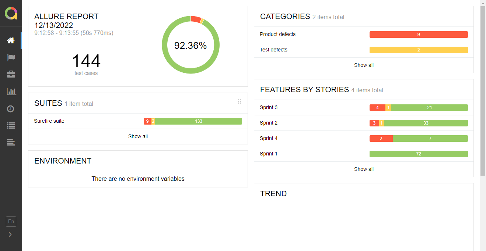
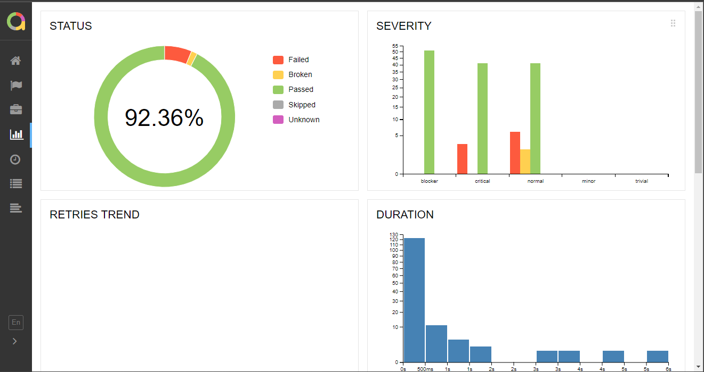
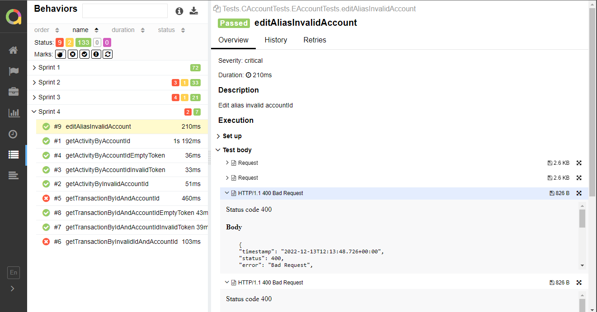
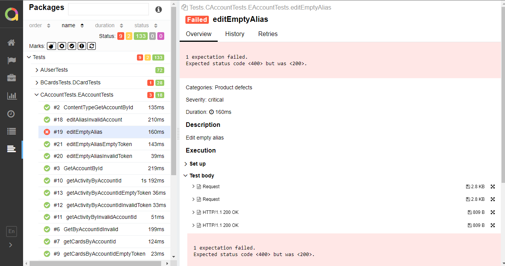

# Proyecto Integrador II

Plan B es un equipo enfocado en el desarrollo de soluciones tecnológicas orientadas a requisitos de software. Los pilares fundamentales que consolidan al grupo son la comunicación, el trabajo en equipo y proactividad.

Este repositorio está organizado por diferentes carpetas, en la que cada una representa una rama de trabajo en la cual todo el equipo ha estado involucrado.

Desarrollamos una API para una billetera digital, la misma permite registrar usarios, agregar tarjetas en una cuenta y realizar transferencias, entre otros. En lenguaje elegido para la construccion del backend fue JAVA, implementamos una estructura de microservicios que se comunica a traves de feign, y la seguridad la menejamos con keycloak. A su vez, se creo una serie de tests que fueron validando el funcionamiento de la misma, y nos permitieron ir corrigiendo errores.

Todos los endopoints inician con: **http://localhost:8080** ya que usamos un gateway que permite usar solo un puerto para la salida de todos los microservicios.

A continuacion detallamos los endopoints que la misma provee, junto con los datos necesarios para realizar la peticion y lo que ofrece de salida.

## USUARIOS

### /user/register
- _Uso:_ Aqui podemos registrarnos a la billetera
- _Tipo:_ POST
- _Parametro entrada:_ Un objeto de tipo User completo   
{  
    "firstName" : "nombre",  
    "lastName" : "apellido",  
    "email" : "email",  
    "dni" : "numero de dni",  
    "phoneNumber" : "numero de telefono",   
    "username" : "nombre de usuario",  
    "password" : "contraseña"  
}
- _Salida:_ Los campos ingresados, mas los que se le crearon
{  
    "id" : "id numerico que se le asigno",  
    "firstName" : "nombre",  
    "lastName" : "apellido",  
    "email" : "email",  
    "dni" : "numero de dni",  
    "phoneNumber" : "numero de telefono",   
    "username" : "nombre de usuario",  
    "cvu" : "el cvu que se le creo",  
    "alias": "el alias que se le creo,  
    "account" :  {     
            "id": "id de la cuenta",   
            "userId" : "el id que se le acaba de asignar al usuario",   
            "balance" : 0   
            },  
    "cards" : []   
}

### /user/login
- _Uso:_ Aqui podemos loguearnos con nuestras credenciales a la billetera
- _Tipo:_ POST
- _Parametro entrada:_ Los datos para loguearse  
{  
    "email" : "email",  
    "password" : "contraseña"  
}
- _Salida:_ Status 200 OK y el token generado

### /user/logout
- _Uso:_ Aqui podemos cerrar la sesion que iniciamos en la billetera
- _Tipo:_ POST
- _Parametro entrada:_ 
- _Salida:_ 

### /user/{id}
- _Uso:_ Aqui podemos traer la info de un usuario por su id
- _Tipo:_ GET
- _Parametro entrada:_ Un id como variable en la url
- _Salida:_ Un objeto User que tenga el mismo id que ingresado o excepciones de no encontrarse uno

### /user/update
- _Uso:_ Aqui podemos modificar los valores almacenados de un usuario
- _Tipo:_ PUT
- _Parametro entrada:_ Los campos a modificar del objeto usuario
- _Salida:_ El objeto User con los antiguos campos que quedaron iguales y los que se modificaron

### /user/{id}/getCvuAlias
- _Uso:_ Aqui podemos traer el CVU y Alias de un usuario segun su id
- _Tipo:_ GET
- _Parametro entrada:_ Un id como variable en la url
- _Salida:_ El CVU y Alias del user que tenga el mismo id al ingresado

## CUENTAS

### /account/{id}
- _Uso:_ Podemos buscar la informacion de una cuenta ingresando su id
- _Tipo:_ GET
- _Parametro entrada:_ Un id como variable en la url
- _Salida:_ El objeto account  
{  
    "id": "id de la cuenta",   
    "userId" : "el id que se le acaba de asignar al usuario",   
    "balance" : el balance de la cuenta,  
    "transactions" : [lista de transferencias asociadas],  
    "cards": [lista de tarjetas asociadas]      
},  

### /account/cards
- _Uso:_ Aca podemos buscar las tarjetas de una cuenta en especifico
- _Tipo:_ GET
- _Parametro entrada:_ Un id de una cuenta como parametro
- _Salida:_ La lista de tarjetas que tienen como accountId al ingresado como parametro

### /account/{accountId}/activity
- _Uso:_ Aca podemos buscar todas las transferencias realizadas por una cuenta
- _Tipo:_ GET
- _Parametro entrada:_ Un accountId como parametro en la url
- _Salida:_ Una lista de transferencias hechas por el accountId especificado

### /account/{accountId}/activity/{transactionId}
- _Uso:_ Aca podemos traer una transferencia en especifico de una cuenta especificada
- _Tipo:_ GET
- _Parametro entrada:_ Un id para la cuenta y otro para la transferencia
- _Salida:_ El objeto transferencia que cumple con lo especificado 

### /account/{id}
- _Uso:_ Aca podemos editar el alias de una cuenta
- _Tipo:_ PATCH
- _Parametro entrada:_ Un id de una cuenta creada como parametro en la url y un nuevo alias como parte del cuerpo
- _Salida:_ El objeto User con el nuevo alias cargado

### /account/{id}/transferences
- _Uso:_ Aca podemos crear una nueva transferencia realizada por una cuenta
- _Tipo:_ POST 
- _Parametro entrada:_ Un id como parametro en la url que pertenecera a la cuenta de origen, y un objeto de tipo transferencia en el cuerpo
- _Salida:_ 

## TARJETAS

### /cards
- _Uso:_ Traer todas las tarjetas de la base de datos
- _Tipo:_ GET
- _Parametro entrada:_ Nada
- _Salida:_ Una lista de tarjetas guardadas

### /cards/{id}
- _Uso:_ Traer una tarjeta en particular
- _Tipo:_ GET
- _Parametro entrada:_ Un id numerico como parametro en la url
- _Salida:_ Un objeto tarjeta que tiene de id el que figura en la url

### /cards/accountId/{accountId}
- _Uso:_ Traer la lista de tarjetas asociadas a una cuenta en especifico
- _Tipo:_ GET
- _Parametro entrada:_ El accountId en la url
- _Salida:_ Una lista de tarjetas con el mismo accountId

### /cards
- _Uso:_ Crear una nueva tarjeta
- _Tipo:_ POST
- _Parametro entrada:_ Un objeto tarjeta completo  
{  
    "accountId" : id de la cuenta que se le asigna,  
    "cardNumber" : "numero de la tarjeta",  
    "type" : "tipo de tarjeta (debito, credito)",  
    "owner" : "nombre del dueño",  
    "securityNumber" : "numero de seguridad",  
    "balance" : plata en la tarjeta,  
    "expirationDate" : "año-mes-dia",  
    "lastNumbers" : "los ultimos 4 numeros de la tarjeta"  
} 
- _Salida:_ El objeto tarjeta que se creo recientemente con su id

### /cards/{id}
- _Uso:_ Para modificar algun campo de alguna tarjeta
- _Tipo:_ PUT
- _Parametro entrada:_ El id de la tarjeta que uno quiere modificar en la url y el objeto tarjeta con los campos a modificar en el cuerpo
- _Salida:_ El objeto tarjeta modificado

### /cards/{id}
- _Uso:_ Para eliminar alguna tarjeta
- _Tipo:_ DELETE
- _Parametro entrada:_ El id de la tarjeta que uno quiere eliminar en la url 
- _Salida:_ Un numero 1 si se pudo eliminar la tarjeta

## TRANSACCIONES

### /transaction
- _Uso:_ Traer una lista con todas las transacciones
- _Tipo:_ GET
- _Parametro entrada:_ Nada
- _Salida:_ Una lista de transacciones

### /transaction/{id}
- _Uso:_ Buscar una transaccion en especifico segun su id
- _Tipo:_ GET
- _Parametro entrada:_ Un id de una transaccion en la url
- _Salida:_ El objeto transaccion que esta asociado a este id

### /transaction/{transactionId}/{accountId}
- _Uso:_ Buscar una transaccion especifica de una cuenta en especifico
- _Tipo:_ GET
- _Parametro entrada:_ Un transactionId y un accountId, ambos en la url
- _Salida:_ Un objeto transaccion que tiene por id el ingresado y que pertenezca a la cuenta ingresada con accountId

### /transaction/accountId/{accountId}
- _Uso:_ Buscar todas las transacciones hechas por una cuenta en especifico
- _Tipo:_ GET
- _Parametro entrada:_ Un accountId ingresado en la url
- _Salida:_ Una lista de transacciones que realizo una cuenta con el accountId

### /transaction
- _Uso:_ Crear una nueva transaccion
- _Tipo:_ POST
- _Parametro entrada:_ Un objeto transaccion con todos sus campos en el cuerpo  
{  
    "accountOriginId" : "id que envia el dinero",  
    "accountDestinyId" : "id que recibe el dinero",  
    "amount" : dinero,  
    "date" : "año-mes-dia",  
    "detail" : "detalle",  
    "type" : "tipo de transferencia"  
}
- _Salida:_ La transaccion creada recientemente con su id asignado

### /transaction/{id}
- _Uso:_ Modificar los campos de una transaccion
- _Tipo:_ PUT
- _Parametro entrada:_ El id de una transaccion en la url y el objeto transaccion con los campos a modificar en el cuerpo
- _Salida:_ El objeto transaccion ya modificado

### /transaction/{id}
- _Uso:_ Eliminar una transaccion en particular
- _Tipo:_ DELETE
- _Parametro entrada:_ El id de la transaccion que una desea eliminar en la url
- _Salida:_ Si fue eliminada exitosamente, un 1

# TESTING

## PRUEBAS AUTOMATIZADAS

### POSTMAN

- Se puede acceder a las colecciones y a los resultados de las pruebas ejecutadas con Postman
a través del siguiente link

[Tests con Postman](https://gitlab.ctd.academy/ctd/proyecto-integrador-2/proyecto-integrador-1022/0321-ft-c2-back/grupo-09/-/tree/dev/testing/Automation%20Testing/Postman/Sprint%20IV)

### REST ASSURED

- El proyecto desarrollado con Maven - RestAssured - TestNG se encuentra en la siguiente carpeta

[Rest Assured Tests](https://gitlab.ctd.academy/ctd/proyecto-integrador-2/proyecto-integrador-1022/0321-ft-c2-back/grupo-09/-/tree/dev/testing/Automation%20Testing/RestAssuredTests)

Este proyecto fue estructurado de la siguiente forma, utilizando el patrón Test Data Builder.

Utilizando IntelliJ, una vez abierto el proyecto, se puede ejecutar la suite completa a través de la
solapa Maven, haciendo click en test, tal como muestra la imagen:

Al finalizar la ejecución de los tests, se genera de forma automática la carpeta "allure-results".
A partir de ahí tenemos 2 formas de ver nuestro reporte:

- Por medio de la consola de IntelliJ, con el siguiente comando

    **allure-serve**

se inicia el reporte dinámico y se abre automáticamente la ventana del navegador mostrando de forma
gráfica los resultados de nuestros tests.

- Por medio del comando

    **allure generate --clean**

se crea en nuestro proyecto la carpeta "allure-report", mostrando en el html el reporte estático de nuestros tests.

### Vista 1 del reporte Allure

### Vista 2 del reporte Allure

### Vista 3 del reporte Allure

### Vista 4 del reporte Allure

